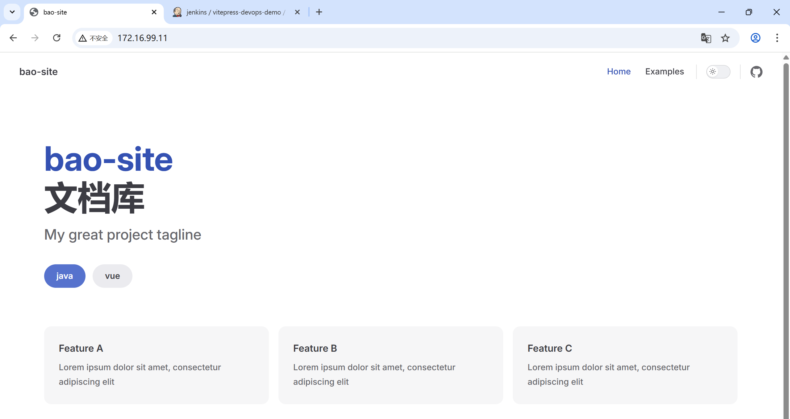
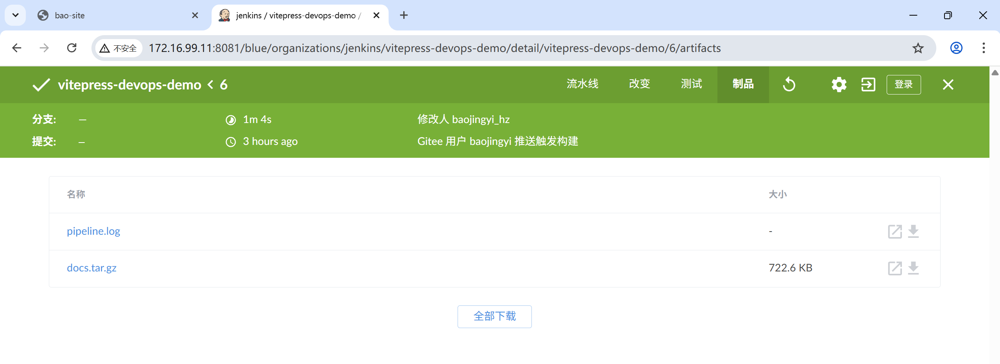

# VitePress-Devops-demo

## 📋 项目简介
使用VitePress创建文档网站，并使用jenkins流水线持续部署

## 🛠️ 技术栈
| 技术 | 版本 | 说明 |
|------|------|------|
| VitePress | Latest | 静态网站生成器 |
| Jenkins | Latest | 自动化服务器 |
| Docker | 20.10.23 | 容器化环境 |

## 📁 项目结构
```text
VitePress-Devops-demo/
│
├── .vitepress/                 # VitePress 核心配置目录
│   └── config.mts             # 配置文件（使用 .mts 扩展名）
│
├── docs/                      # 文档内容主目录
│   ├── front/                # 前端文档
│   │   └── vue.md           # Vue 相关文档
│   └── back/                 # 后端文档
│       └── java.md          # Java 相关文档
│
├── 根目录文档（可直接访问）
│   ├── index.md              # 网站首页（路由：/）
│   ├── api-examples.md       # API示例文档（路由：/api-examples）
│   └── markdown-examples.md  # Markdown示例（路由：/markdown-examples）
│
├── 项目配置文件
│   ├── package.json          # 项目依赖和脚本
│   ├── package-lock.json     # 依赖锁定文件
│   ├── .gitignore           # Git忽略规则
│   └── Jenkinsfile          # CI/CD 流水线配置
│
└── 说明文件
    ├── README.md             # 项目说明文档
```

## 📦 环境要求
- Node.js 18+ 和 npm/yarn/pnpm
- Docker 和 Docker Compose
- Gitee 账号（或 GitHub）
- Jenkins 基础了解

## 🚀 快速开始
### VitePress创建个人文档网站（类似于博客）
参考官网文档：`https://vitepress.dev/zh/guide/getting-started`
```bash
npm add -D vitepress@next
npx vitepress init
npm run docs:dev
npm run docs:build //打包
```
创建个人文档网站，根据需要修改里面的内容

### gitee仓库
可以在WebStorm中登录gitee账户，然后直接推送

### 部署jenkins
```docker
docker run -d \
  --name jenkins \
  -u root \
  -p 8081:8080 \
  -p 50000:50000 \
  -v jenkins-data:/var/jenkins_home \
  -v /var/run/docker.sock:/var/run/docker.sock \    //映射宿主机的docker
  -v /usr/bin/docker:/usr/bin/docker:ro \
  -v /usr/libexec/docker:/usr/libexec/docker:ro \
  --restart=always \
  jenkins/jenkins:latest
```
测试：
* 在jenkins中docker pull node
* 安装nginx，把前面打包的dist下面的文件放到/usr/share/html中（注意这里只是测试，然后需要删除或者停止nginx，否则占用80端口）
```
创建流水线vitepress-devops-demo，
勾选Gitee webhook 触发构建、
Pipeline script from SCM、
Jenkinsfile（这个文件需要在webstorm添加，按照流水线语法）
```

### 配置jenkins
* 首次打开jenkins需要安装插件，创建用户，并下载Blue Ocean插件（优化 Jenkins 流水线的管理和可视化）
```text
第一步：确保Gitee插件已安装
在Jenkins中：
系统管理 → 插件管理
安装 Gitee Plugin

第二步：配置Gitee连接
系统管理 → 系统配置
找到 Gitee配置 部分
添加Gitee连接：
Gitee API URL: https://gitee.com
Credentials: 添加Gitee Personal Access Token  //在gitee中创建Token

第三步：在项目中配置构建触发器
进入Job：vitepress-devops-demo
配置 → 构建触发器
生成Webhook URL（会自动生成类似）：
https://ip/gitee-project/vitepress-devops-demo/  //修改为自己的ip
复制这个URL

第四步：Gitee Webhook配置
在Gitee仓库 → 管理 → WebHooks：
URL: https://stenohaline-nondeclaratively-sunni.ngrok-free.dev/gitee-project/vitepress-devops-demo/  //可以测试这个网址是否可以访问到
```

测试，在webstorm中修改md然后推送到仓库，可以在jenkins中使用bule ocean插件看到流水线开始自动部署

### 其他问题
webhook的ip需要时公网ip，如果是在自己虚拟机中进行创建可以使用ngrok（内网穿透），会得到一个公网地址
```
wget https://bin.equinox.io/c/bNyj1mQVY4c/ngrok-v3-stable-linux-amd64.tgz
tar -xzf ngrok-v3-stable-linux-amd64.tgz -C /usr/local/bin/
chmod +x /usr/local/bin/ngrok

在https://dashboard.ngrok.com/get-started/setup/windows中复制your-authtoken，在服务器上配置authtoken

ngrok http 8080  //启动ngrok
```

## 📊 效果截图





